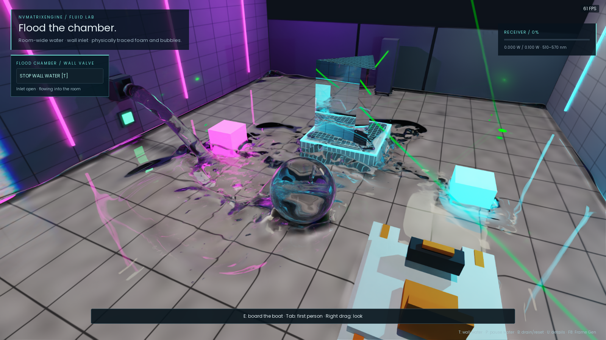
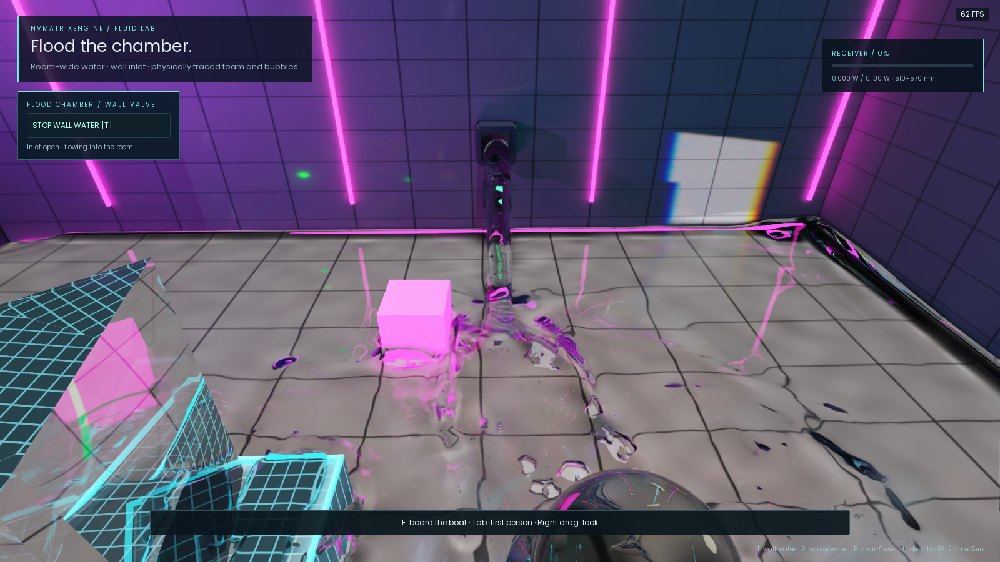
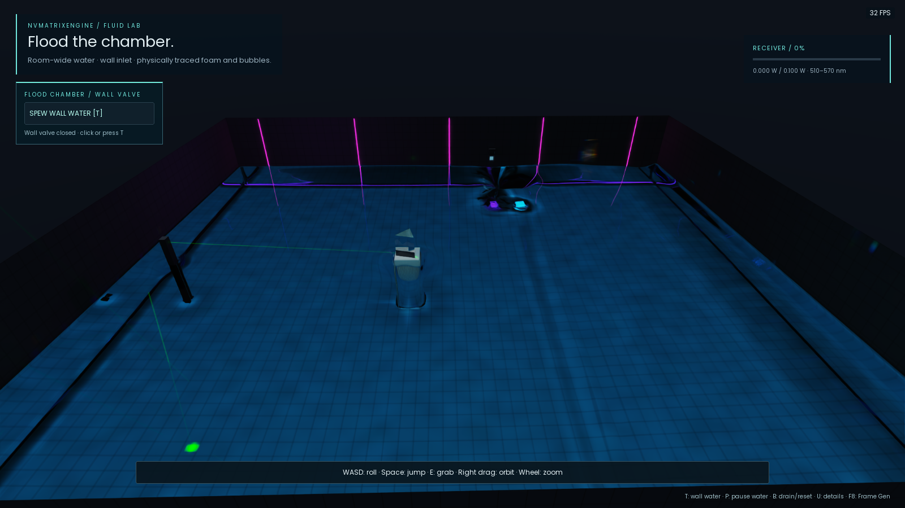

# NVMatrixEngine — Real-Time Game Engine

The [Hamiltonian wave/3D-flow path](engine/HAMILTONIAN_WATER.md) is the Large Water Lab default and optional in the small lab:
launch with `--water-path=hamiltonian --normal-lens --boat`, or use
**Play Hamiltonian Water Lab.cmd** in a built runtime.

**A C++20 / DirectX 12 game engine with GPU liquid simulation, path-traced lighting and spectral caustics on NVIDIA RTX GPUs.**

NVMatrixEngine couples **APIC/FLIP fluid simulation** with **DirectX Raytracing (DXR)**: a reconstructed liquid surface participates directly in path-traced reflection, refraction and light-side spectral photon mapping. It includes rigid-body gameplay, an interactive settings UI, audio, a staggered MAC pressure grid, anisotropic particle surface reconstruction, sparse procedural water geometry, DLSS Ray Reconstruction, and optional CUDA and ReSTIR PT modes.

The flagship **Water Lab** is a playable, room-scale pool: open the wall inlet, roll or dive as a sinking glass ball, propel a buoyant boat, and watch animated water redirect light onto the white grid floor. Source, a portable Windows demo, real engine videos, numerical tests and implementation notes are included.

[Download Water Lab v0.1.4](https://github.com/codejeet/NVMatrixEngine/releases/tag/v0.1.4-preview) · [Engine development](#engine-development) · [Algorithms](docs/ARCHITECTURE.md) · [Build](docs/BUILDING.md) · [Roadmap](docs/ROADMAP.md)



This independently developed **game engine is in preview**. The source includes the native engine and the shared code needed by its demos. NVIDIA does not sponsor or endorse this project.

## Implemented GPU fluid simulation and rendering algorithms

| System | Implemented capability |
| --- | --- |
| Native rendering | Custom C++20 / DX12 / DXR renderer; camera and photon `DispatchRays` passes; capability-gated Shader Execution Reordering |
| Light transport | Camera path tracing plus light-side spectral photon tracing; reflection, refraction, Fresnel, total internal reflection, dispersion, and texture-space caustics |
| Water simulation | Affine Particle-In-Cell (APIC), optional Fluid-Implicit-Particle / Particle-In-Cell (FLIP/PIC), staggered marker-and-cell (MAC) velocities, pressure projection, moving solid boundaries, viscosity and surface-tension models |
| Continuous water geometry | Anisotropic particle reconstruction into a sparse brick scalar field; procedural AABB BLAS/TLAS; cell-wise root-refined DXR intersections |
| Water optics | Animated dielectric boundaries, depth-dependent Beer–Lambert absorption, underwater views, and laser single scattering |
| Reconstruction / presentation | DLSS Ray Reconstruction with super resolution, optional DLSS Frame Generation / Multi Frame Generation, and Reflex integration |
| Interaction | Bullet rigid bodies, glass ball sink/float density, GPU-sampled buoyancy, powered boat, wall emitter, bounded foam/bubbles/spray |
| Interface | RmlUi settings, lighting presets, flashlight, lens/view modes, simulation sliders, audio, debug overlays and GPU timings |
| Experimental modes | CUDA/DX12 interop, graph replay, mixed-resolution pressure, live narrow-band particle/grid ownership, adaptive optical sampling, and RTXDI-based ReSTIR PT |

### Light transport, in plain terms

The renderer traces from **both the camera and the lights**, combining eye-path illumination with light-side photons that have passed through glass or water. This makes difficult refractive caustics practical without asking random camera paths to discover every focused light path.

That is a hybrid, two-sided transport architecture—not a claim that general bidirectional path tracing with vertex connection/MIS, or **ReSTIR BDPT**, is complete. The optional **ReSTIR PT** mode is implemented for multi-bounce diffuse indirect lighting from opaque primary surfaces. It does not yet reuse GI behind refractive camera prefixes. [Algorithm details and scope](docs/ARCHITECTURE.md#light-transport).

**Engine-wide rendering defaults:** fast RIS light sampling, one base camera path, two full light samples, four imported-light candidates, four surface bounces, and Russian roulette. Adjust them under **Esc → Path tracing**. [Settings and prior measurements](engine/RENDER_SAMPLING.md).

**Neon Night:** launch `engine/Play Neon Night.cmd` or `NVMatrixFluidLab.exe --scene=neon-night` for a playable wet neon alley with imported CC0 props, PBR materials, the rolling ball, FPS display and Esc settings. [Scene and credits](engine/NEON_NIGHT.md).

## Engine development

The engine integrates **real-time liquid rendering**, **GPU particle-grid simulation**, **refractive caustics**, and interactive rigid-body gameplay. Water participates in reflections, underwater views and light transport. These entry points explain how the engine's simulation and renderer work together.

| Engine subsystem | Start here |
| --- | --- |
| How do I load glTF, GLB or OBJ objects with PBR textures? | [Model loading and material support](engine/MODEL_LOADING.md) |
| Where is the neon alley scene? | [Neon Night: launch, assets and rendering](engine/NEON_NIGHT.md) |
| How do APIC/FLIP transfers and incompressible pressure projection map to GPU compute? | [Fluid solver architecture](docs/ARCHITECTURE.md#liquid-solver), [MAC implementation](engine/src/fluid/fluid_mac.cpp), [HLSL kernels](engine/shaders/fluid/) |
| How can a ray tracer intersect a particle-reconstructed liquid without meshing? | [Anisotropic reconstruction](engine/shaders/fluid/reconstruction.hlsl), [procedural DXR intersection](engine/shaders/fluid/intersection.hlsli), [scalar-field representation](docs/ARCHITECTURE.md#surface-representation-and-intersection) |
| How are dynamic water and glass caustics computed? | [Spectral photon transport](engine/shaders/transport.hlsl), [photon sampling](engine/shaders/photon-sampling.hlsli), [water optics](engine/WATER_OPTICS.md) |
| Where are path reuse and adaptive ray allocation implemented? | [RTXDI ReSTIR PT integration](engine/shaders/restir-pt.hlsli), [adaptive optics](engine/ADAPTIVE_OPTICS.md), [current reuse limits](docs/ARCHITECTURE.md#restir-pt-and-adaptive-optics) |
| What is implemented for CUDA interop and narrow-band FLIP? | [CUDA solver](engine/src/fluid/cuda/), [DX12 interoperability](engine/CUDA_FLUID.md), [live particle/grid ownership](engine/NARROW_BAND.md) |
| How can results be reproduced or compared? | [Build and test instructions](docs/BUILDING.md), [release validation](docs/VALIDATION.md), [optimization acceptance criteria](docs/ROADMAP.md) |

The sparse rendering field is a **reconstructed scalar field**, not a guaranteed exact signed-distance field (SDF). The baseline simulation uses a bounded dense grid; sparse surface bricks do not imply a fully sparse fluid solver. CUDA, adaptive pressure and narrow-band modes are experiments, not advertised speedups. The current integrator is camera path tracing plus photon caustics—not a completed ReSTIR BDPT implementation. See the [architecture and limitations](docs/ARCHITECTURE.md) before using this as a comparison baseline.

To discuss a result or report a numerical/rendering issue, [open an issue](https://github.com/codejeet/NVMatrixEngine/issues) with the commit/release, GPU, driver, launch arguments and bounded-run JSON. Public visibility is for review; reuse requires the permissions described in [COPYRIGHT.md](COPYRIGHT.md).

## Water Lab demo: path-traced water, caustics and underwater views

### Live recordings

Recorded from the running engine at 720p / 30 fps with DLSS RR Quality and frame generation off. The main showcase uses a solid sinking ball, ordinary roll/jump inputs and a following camera. These are visual demonstrations, not FPS benchmarks. [Capture setup](docs/videos/README.md).

**Water room — sinking glass ball rolling, jumping and disturbing the water:**

https://github.com/user-attachments/assets/9f3146c7-efc4-493c-8bf2-2a3a0286eda1

**Underwater — first-person view beneath the animated dielectric surface:**

https://github.com/user-attachments/assets/9dcae60b-1e34-4413-a2ed-c8f541ffc389

**Wall inlet — animated fluid refraction and surface interaction:**

https://github.com/user-attachments/assets/58ea2f2e-5936-4e31-9a43-6acbeb748464



Water is simulated in three dimensions, not as a displaced plane. Simulation particles carry motion; a MAC grid enforces approximate incompressibility; a reconstructed continuous field is the geometry seen by camera rays, shadow rays, and caustic photons. There is no screen-space water surface or marching-cubes mesh in the primary rendering path.

The default room starts with approximately **100,000 particles**. Settings reserve up to **1 million particles**, expose MAC cell spacing and simulation frequency, and keep filling bounded: the inlet closes at capacity instead of silently deleting water. Higher capacity is not the same as higher active particle count.

The main release launcher uses the **DX12 uniform-grid baseline**. CUDA and adaptive modes are opt-in because their additional machinery is not yet a demonstrated end-to-end speedup in this scene. The Large and Ocean launchers use Hamiltonian waves with fixed fluid cell sizes and local 3D activity regions. Optional CUDA/deep-pool experiments remain in the source and are excluded from this portable package.

**Deep pool — a larger body of water with calmer interior regions:**

https://github.com/user-attachments/assets/74b52c64-3163-4d68-ab98-331f22f1a4bf



### Try it

1. Download the ZIP from the [v0.1.4 preview release](https://github.com/codejeet/NVMatrixEngine/releases/tag/v0.1.4-preview).
2. Extract the **entire** folder to a writable location; do not run inside the ZIP.
3. Open **Play Water Lab.cmd**, or double-click `NVMatrixFluidLab.exe` for the default water room.
4. Press **Esc** for DLSS RR Quality/Balanced/Performance, frame generation, lighting, lens, buoyancy, water quality, and music settings.

No installer, administrator access, CUDA Toolkit, Visual Studio, or SDK downloads are required to run the packaged demo. A current compatible NVIDIA graphics driver is required. This preview is unsigned; Windows may display a reputation warning. Only use release assets from this repository and verify the accompanying SHA-256 checksum if needed.

| Controls | Action |
| --- | --- |
| WASD / Space | Move / jump; hold Space underwater to swim upward |
| Right-drag / wheel | Orbit or look / zoom |
| Tab / Ctrl | First-person view / dive |
| T / I | Toggle the inlet / inlet view or ocean overview |
| Y | Toggle ocean day/night |
| E | Interact, grab, or board/exit the boat near it |
| W/S, A/D aboard | Thrust and steering |
| P / period / B | Pause water / single step / reset water |
| Esc / U | Settings / additional HUD detail |
| F8 | Cycle supported frame-generation modes |

The camera defaults to a **90° diagonal FOV**, adjustable in settings for both the normal lens and optional equisolid fisheye. The fisheye models a lens projection, not a full compound lens assembly. **Both lens modes support frame generation**; fisheye supplies DLSS with a cached bidirectional distortion map.

In the indoor labs, the glass ball starts as **solid glass in Sink mode (2,500 kg/m³)** from physics construction onward. The ocean preset starts with a lighter hollow ball. Esc → Ball buoyancy switches to the lighter hollow Float mode without resetting the scene. The selected mode survives chamber resets; a new session uses its preset’s default.

## Hardware and performance

- Windows 11 x64 and a high-end NVIDIA RTX GPU are the intended platform.
- Development runs use an **RTX 5090**. The v0.1.4 package uses the existing optimized build; release tests were skipped at the maintainer's request. Other GPUs are not certified by this preview.
- DLSS feature availability is queried at runtime. Frame generation depends on GPU, driver, OS configuration, and supported presentation mode; it does not accelerate simulation or raw rendering.
- Both normal and fisheye lenses support FG. The HUD reports actual presentations so you can see whether extra frames are being generated. See [validation scope](docs/VALIDATION.md).
- This portable release uses DX12 fluid simulation. Optional CUDA experiments remain available in source builds.
- Resolution, active particles, fluid depth, inlet activity, photon budget, and experimental solvers materially affect frame time. There is **no blanket 60 FPS guarantee**.

The engine reports raw rendering/simulation timings separately from generated presentation frames. See [release validation and measurement scope](docs/VALIDATION.md). The project prioritizes reproducible comparisons over multiplying an FPS counter by the frame-generation factor.

The HUD shows **Render FPS** and **DLSS output FPS** continuously. Output includes actual generated presentations reported by DLSS; the status says when FG is off, paused, generating, or reporting no extra frames. RR upscaling alone does not add frames. Esc → DLSS & Performance changes the upscaling mode immediately and shows the actual input/output resolution; water keeps its current state.

## Engine map

```text
engine/src/renderer.*       DX12 resources, DXR pipelines, frame orchestration
engine/src/fluid/           GPU liquid subsystem, surface, pressure, CUDA, buoyancy
engine/shaders/             HLSL transport, caustics, reconstruction and fluid kernels
engine/src/streamline.*     DLSS RR / FG and Reflex integration
engine/src/gameplay.*       Demo interaction and rigid-body integration
engine/ui/                 RmlUi markup and styling
engine/tests/              Native numerical, gameplay and GPU fixtures
shared/                    Minimal common audio, UI, camera and rigid-body support
docs/                      Current architecture, build guide, captures and roadmap
release/                   Portable launchers and packaging inputs
```

See [BUILDING.md](docs/BUILDING.md) to build the DX12-only or optional CUDA configuration. Algorithm experiments and their evidence are retained in [the engine notes](engine/README.md); older checkpoint statements describe their date, not necessarily the current integrated feature set.

## Engine roadmap: path-tracing and water-simulation optimization

The next major work is **path-tracing optimization** and **water-simulation optimization**: reduce procedural intersection and photon cost, improve stable reuse through refraction, bound adaptive topology work, and make coarse bulk ownership save actual frame time. Full ReSTIR BDPT, fully sparse multiresolution simulation, and general multiple-scattering liquids remain future work, not shipping claims. [Detailed roadmap and acceptance criteria](docs/ROADMAP.md).

## Citing NVMatrixEngine

For a paper, presentation or benchmark discussion, cite the software and identify the exact version/commit and configuration you evaluated. [CITATION.cff](CITATION.cff) provides machine-readable metadata for GitHub's citation tools. This is a software preview, not a peer-reviewed publication or reproduction of every referenced paper. Citation does not grant additional source or asset rights.

## Credits and terms

Built around original engine integration with NVIDIA Streamline/DLSS, NVAPI, RTXDI PT, the DirectX 12 Agility SDK, Bullet, RmlUi, FreeType, and miniaudio. Spectral conversion uses the [CIE 1931 standard-observer dataset](https://doi.org/10.25039/CIE.DS.xvudnb9b). The demo includes a custom soundtrack; startup selection is randomized and volume defaults low.

Public source is available for portfolio review; **an open-source license has not been granted**. See [COPYRIGHT.md](COPYRIGHT.md) and [third-party notices](THIRD_PARTY_NOTICES.md). Third-party components and the CIE dataset retain their own licenses. SDK caches and development credentials are not included in this repository.

The new [Large Water Lab](engine/HAMILTONIAN_WATER.md#large-water-lab) keeps the Water Lab scene with four times the floor area and 1.5 m default depth. Launch [Play Large Water Lab.cmd](engine/Play%20Large%20Water%20Lab.cmd).

For the outdoor scene, launch [Play Extra Large Water Lab.cmd](engine/Play%20Extra%20Large%20Water%20Lab.cmd): a 256 × 256 m Hamiltonian ocean with 6 m offshore depth, a beach island, palms, pier, boat, and HDRI day/night lighting (`Y`). [Controls, physical assumptions and limits](engine/OCEAN_LAB.md).
