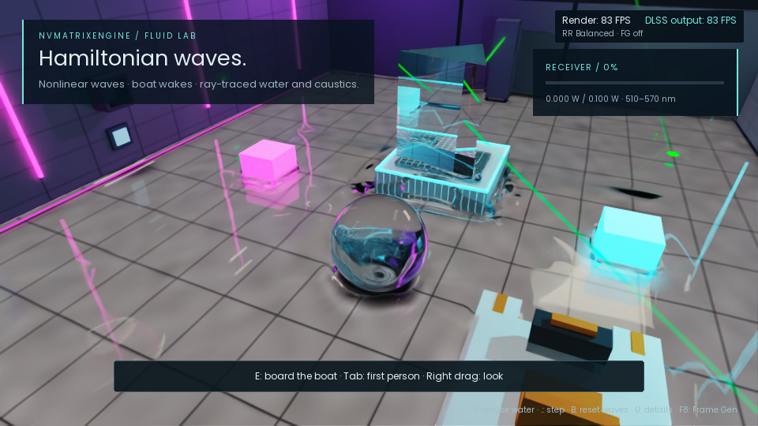
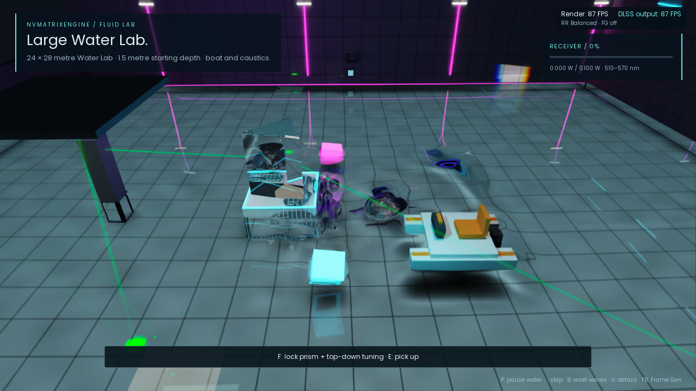
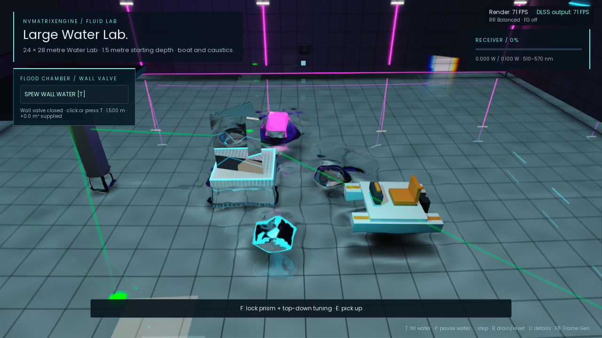
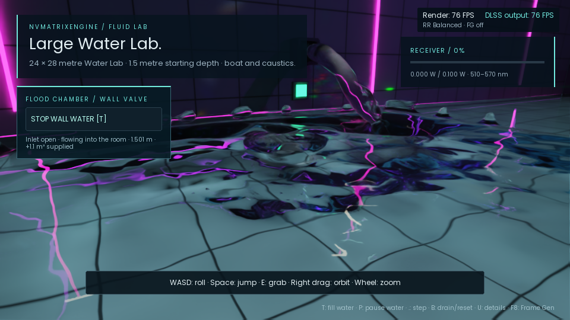

# Hamiltonian Water Lab path

Double-click [Play Hamiltonian Water Lab.cmd](Play%20Hamiltonian%20Water%20Lab.cmd)
in this folder to launch the local Windows build. A launcher with the same name
is also available in the built portable runtime. Both enable the boat, normal
lens, DLSS Balanced and automatic frame generation. Or run:

```powershell
NVMatrixFluidLab.exe --water-path=hamiltonian --normal-lens --boat --quality=balanced
```

The Hamiltonian path couples GPU nonlinear waves to the existing DX12 APIC/FLIP solver.
Both feed one procedural DXR surface used by camera rays, spectral photons,
dielectric transport and DLSS Ray Reconstruction. `--restir-pt` remains available.
The small Water Lab defaults to the legacy full 3D solver. `--water-lab=large`
defaults to Hamiltonian coupling. Explicit `--water-path=baseline` or
`--water-path=hamiltonian` overrides either room's default, regardless of argument order.



## Large Water Lab

[Play Large Water Lab.cmd](Play%20Large%20Water%20Lab.cmd) launches the new
**24 × 28 metre** Water Lab with **1.5 metre** starting water depth. It uses the
ordinary Water Lab's materials, optical cradle, props, boat and controls. The
walls, floor, collision geometry, receiver chart areas and overhead illumination
cover four times the area. Props and fixtures rise with the starting water level
and retain their original size. This is independent of the older deep-pool preset.



```powershell
NVMatrixFluidLab.exe --water-lab=large --normal-lens --boat --quality=balanced
```

Use `--water-path=baseline` with the same preset for the full 3D comparison.
Both use 24 cm cells and the same equivalent 600,000 initial samples. The
Hamiltonian path activates only the share selected for 3D simulation. The ordinary small Water Lab
and its defaults remain available. Grid settings in the large room span 20–32 cm.
Press `I` for the expanded basin overview; `Tab` switches to first person.
The playable camera and controller are shared with the small Water Lab: mouse
drag orbits, the wheel zooms, WASD moves, Space jumps, Ctrl dives and E boards or
leaves the boat. Camera collision limits and boat exit positions use the actual
room walls, including the expanded floor and raised wall height.

## Performance and allocation

The adaptive path keeps a basin-wide MAC address space and the normal particle
capacity, allowing independent 3D regions anywhere in the room. It creates live
particles and pressure unknowns only in selected regions and their coupling
reservoirs. Calm columns use Hamiltonian waves. Dense dispatches and reserved
buffers still have a cost; this is not yet sparse grid-memory allocation.

Measured adaptive-path results on RTX 5090, MSVC Release, 1280×720 output,
DLSS Balanced, frame generation off, normal player camera and no other lab
window open. Each figure is the median of three 240-frame runs, excluding the
first 32 frames of each run; solver order alternates between repeats.

| Room | Full 3D frame | Hamiltonian frame | Full 3D simulation | Hamiltonian simulation |
| --- | ---: | ---: | ---: | ---: |
| Large, 24×28 m / 1.5 m deep | 26.33 ms | 15.93 ms | 8.17 ms | 6.42 ms |
| Small, ordinary defaults | 13.31 ms | 15.09 ms | 3.06 ms | 4.58 ms |

The large room delivers **1.65× frame throughput** (39.5% less frame time).
Simulation alone is 1.27× faster; surface reconstruction falls from 9.31 to
0.67 ms and supplies much of the overall saving. The small room takes **13.3%
more frame time**: the spectral/coupling work outweighs the smaller amount of
3D work it replaces. Frame time is the renderer's measured wall time; simulation
and reconstruction use GPU timestamps. These are settled-room measurements,
not a guarantee for every inlet or highly excited scene, and the two solvers
have different approximation errors. See the individual runs and settings in
[large-water-validation.json](large-water-validation.json).



## Source and numerical method

Independent HLSL/C++ implementation based on Wang et al., **Hamiltonian Two-Way
Coupling of Nonlinear Waves and 3D Flows**, SIGGRAPH Asia 2026:

- [Paper, arXiv:2608.25203](https://arxiv.org/abs/2608.25203)
- [Project](https://hamwave.sinanw.com/)
- [Reference implementation](https://github.com/swang3081/Hamiltonian-Two-Way-Coupling-of-Nonlinear-Waves-and-3D-Flows),
  inspected at `afca6592835ba579a27075d65fe94763dc02554d`.

The runtime does not import the reference project's Python, Torch, Warp, CUDA or
AMG solver. The normal shader compilation step builds the new HLSL kernels.

| Paper component | Implementation |
| --- | --- |
| Canonical `(eta, psi)`, equations 6–11 | Finite-depth `G0 = k tanh(k d)`, Craig–Sulem `G1`, optional `G2`, consistent nonlinear Bernoulli RHS |
| Reflecting boundaries, section 3.3 | Cell-centred even extension from 32×32 to 64×64; shared-memory radix-2 row/column GPU FFTs |
| Exact-linear integration, equations 14–17 | Exponential propagation, nonlinear AB2 forcing and Craig–Sulem state filter; bootstrap after reset/coupling changes |
| Depth reconstruction, equations 21, 26–29 | First-order potential lift and eight velocity layers; stable exponential kernels with zero bottom-normal velocity |
| Fluxed animated boundary, section 4.1 | Four-cell lateral ring excluded from pressure unknowns, prescribed submerged MAC velocities and GPU particle recycling/reseeding |
| Reverse coupling, equations 30–34 and 19 | Connected particle implicit-surface heights, smoothing, exponential elevation relaxation and eight inverse-DNO iterations preserving wave kinematic velocity |

The two directions run at each actual liquid substep using its fixed timestep.
Pause, single-step and reset share the existing fluid clock. Reset clears the
canonical state, nonlinear history, counters and previous render height. Only
compact diagnostics cross the renderer's existing frame fence; normal play does
not download particles or spectra.

## Controls

| Switch | Default | Meaning |
| --- | --- | --- |
| `--wave-order=2` or `3` | `2` | DNO truncation; HOS-2 matches the reference coupled solver's default |
| `--wave-epsilon=0..1` | `0.2` | Nonlinearity; zero gives finite-depth Airy waves |
| `--wave-amplitude=<metres>` | `0.035` | Combined peak bound of initial standing modes; at most 15% of water depth |
| `--wave-relaxation=0..100` | `10` | Reverse height-coupling rate per second; zero is the one-way ablation |

`T` toggles filling; the wall button and `E` near the valve also work.
`P` pauses water **and filling**, `.` advances one paused simulation substep,
and `B` drains the added water and resets both solvers. `--fluid-emitter` starts
with the valve open. Throw objects or pilot the boat to generate disturbances
inside automatically selected 3D regions. Water resolution/rate settings rebuild both solvers.

The inlet emits mass-carrying water particles at the existing physical rate
(about **0.568 m³/s**). The visible stream is reconstructed from those particles
into the same water surface used for refraction, photons, shadows and motion
vectors. Source position and velocity are ordinary emitter inputs.



Use `--inlet-view --fluid-emitter` to start near the running spout.

Free water follows gravity and scene SDF contacts throughout the basin. When it
reaches connected water, its volume and momentum transfer into the canonical
wave state; inside a selected pressure region, the actual particle also joins
APIC/FLIP. Detached water leaving that region debits the wave volume and remains
simulated until it lands. The GPU checks the invariant **net received particles
+ free-water particles = emitted particles** after every frame. Reference depth
is rebased from this measured transfer ledger, not from the valve state.

Closing the valve stops births; the existing stream keeps falling. `P` freezes
both phases, and `B` clears particles, waves and transfer history. A solid can
intercept water and delay its arrival. The default flow eventually raises the
small basin about **3.4 mm/s**, or the large basin about **0.85 mm/s**, after the
stream reaches the pool. Wave feedback preserves the transferred volume.

The source closes at its total-volume budget, including water still in flight,
retaining 40% of spare particle IDs for boundary exchange and splashes. GPU admission
also stops births if free IDs run low (for example, water accumulating behind an
obstruction); already emitted water remains simulated. Defaults
allow roughly **0.43 m** connected depth in the small room and **1.92 m** in the
large room after airborne water settles. The reservoir sizes itself, so the
inlet-capacity slider remains hidden. The valve panel shows basin depth and
supplied volume; reports expose emitted, free and received particle counts plus active columns and region changes.

This remains a hybrid approximation: free-water particles use ballistic transport
and solid contacts until they join connected water. The full 3D pressure solve
runs only for fluid represented in selected 3D regions. The wave projection resolves
deposited momentum at wave grid scale. Rectangular-basin volume also does not
include exact solid-displaced volume in the overlapping particle region.

## Scope and adaptations

This bounded Water Lab implementation does not reproduce every paper scene or
accuracy result. The wave domain covers the room. A GPU activity field selects
**disconnected 3D regions** from the actual fluid and collider state:

- Submerged solids and predicted contact, including stationary bodies. Swept
  SDF queries protect a short leading region and trailing wake.
- Resolved particle vorticity and velocity relative to the wave solution.
- Steep wave slopes and actual airborne water approaching the surface.

Selection does not depend on the camera, player identity or valve state. Requests
retain one second of decaying activity history; region boundaries retreat at
0.5 m/s when demand disappears. A four-cell reservoir surrounds each region,
followed by a smooth overlap. New regions initialize from the current wave
height and velocity, while their outgoing height feeds the canonical wave state.
The pressure and density projections exclude the prescribed reservoir. Reservoir
samples cannot become detached physical splashes unless they previously belonged
to the pressure interior.

Feedback and rendering use the same isotropic weighted-centre particle surface.
Its radius follows the kernel's analytic half-space centroid, so a flat particle
volume and a wave plane share their rest height. Feedback locates the connected
surface with the actual implicit field rather than highest-particle extrema.
There is no rectangular render boundary around the avatar. The wave height field
still cannot represent overturning; selected 3D regions and free-water particles
supply that geometry.

`--fluid-particles` specifies the equivalent full-room rest density. The same
capacity remains addressable across the basin; only live records enter particle
neighborhoods. The 24 depth-velocity FFTs run in a batch. Reconstruction bounds
current wave heights on the GPU to skip empty air while retaining signed
underwater cells for camera medium detection, buoyancy and bubbles.

- Strict **2/3 spectral truncation** at every quadratic product replaces the
  reference's 3/2 zero padding, trading fewer retained modes for smaller FFTs.
- Particle implicit geometry replaces the paper's level set. Connected-column
  implicit-surface roots and four smoothing passes supply height targets. Three empty
  cells terminate a connected column, excluding detached spray above it. The
  feedback ramp excludes the prescribed FAB ring.
- The boundary reseeds a rest-volume lattice from a GPU free list and retires
  outgoing boundary particles. This is an open reservoir; legacy closed-volume
  `--fluid-validate` fixtures are rejected. Overflow and nonfinite states fail
  explicitly rather than silently dropping requested boundary samples.
  Horizontal samples are stratified with a deterministic phase per substep, so
  slow inflow can cross the inner boundary even when a step's displacement is
  smaller than the rest spacing. A fixed respawn lattice would stall that flux.
- A coupling update changes the canonical state. The next step discards stale
  AB2 forcing and uses exponential-Euler bootstrap; uncoupled runs retain AB2.
  Initial 3D particles use the wave height and layered velocity.
- Sources integrate physical volume over advanced simulation time, then spawn
  particles from the shared GPU free list. Free water has world-space surface
  bins independent of the selected pressure regions. Conservative transfer packets
  carry received volume and normal/tangential impulse into the wave solver.
  The boundary correction follows measured net transfers between representations.
- Wave and particle scalars blend through the overlap before solid carving and
  BLAS construction. Camera, shadow, photon and buoyancy queries share that
  trilinear field. Wave motion uses the previous rendered height.

CUDA fluid, deep-pool presets, alternative pressure/ownership solvers, legacy
solver fixtures and adaptive surface LOD are unsupported with this path. Spectral
work, inverse-DNO iterations and reconstruction still have a cost; performance
depends on the amount of 3D work replaced by the surface model.

## Validation

```powershell
powershell -NoProfile -ExecutionPolicy Bypass -File engine/build.ps1
powershell -NoProfile -ExecutionPolicy Bypass -File engine/test-hamiltonian.ps1
powershell -NoProfile -ExecutionPolicy Bypass -File engine/test-large-water.ps1
powershell -NoProfile -ExecutionPolicy Bypass -File engine/test-hamiltonian-fill.ps1
powershell -NoProfile -ExecutionPolicy Bypass -File engine/test-hamiltonian-regions.ps1
```

`NVMatrixEngineHamiltonianGpuTest` checks production shaders against analytic
finite-depth dispersion and harmonic extension, verifies nonlinear second
harmonics and the HOS-3 correction, checks reset determinism, and tests canonical
feedback from a manufactured 3D surface. It is separate from hardware-independent
CTest. The smoke script runs the rendered baseline, linear coupled path, HOS-2
and HOS-3 serially, checks pause/single-step/reset/resume and rejects invalid
options. Reports include the water path,
order, epsilon, step count, boundary exchange, nonfinite/overflow counts and
inverse-DNO residual.

The region fixture checks separated submerged bodies, dry-body exclusion, gradual
demotion back to waves and vorticity-driven promotion without an emitter or body.
A flat-volume regression checks that particle/wave overlap creates no raised
region; its maximum measured height error is below 0.9 mm.
The [adaptive-region results](hamiltonian-regions-validation.json) record eight
rendered cases covering both room sizes, moving bodies, controls, HOS-3 and inlet
flow. The large-room overview selects about 14% of wave columns for full 3D
pressure, plus their surrounding reservoirs. These are functional regressions;
their runs are not used as isolated GPU performance measurements.

The source fixture checks that a solid shelf can hold emitted water without
raising the basin, then removes the shelf and verifies that the same particles
fall and transfer their exact volume with the source already closed. It also
checks mean-preserving depth rebase, reset, and admission at particle-pool
exhaustion. Rendered tests cover visible streams, `T` / `E` / UI controls,
pause, single steps, stopped births, reset,
filling during region changes, HOS-3 and default-rate CLI emission. Reports verify the
particle/wave mass ledger and published GPU mean height. See the current
[adaptive-region validation results](hamiltonian-regions-validation.json);
[earlier inlet results](hamiltonian-fill-validation.json) retain the fixed-region runs.

Verified on RTX 5090 / Windows x64 MSVC Release: numerical fixtures, five
baseline/wave/control smoke cases, eight adaptive-region render cases,
invalid-option checks and 241 existing Node tests passed.
The camera/control update additionally passes gameplay, orbit-input, rolling
camera and watercraft CTests, including large-room first-person tracking,
wall clearance, boat exit placement, and movement/jump parity. The refreshed
large-water script passes three rendered regressions and twelve paired timing runs.
A separate 600-frame large-room HOS-3 run at `epsilon=1` completed 1,200 coupled substeps
without nonfinite state or boundary overflow. See
[the adaptive-region validation](hamiltonian-regions-validation.json). This does not certify
paper-scale convergence or D3D debug-layer/GPU validation.
