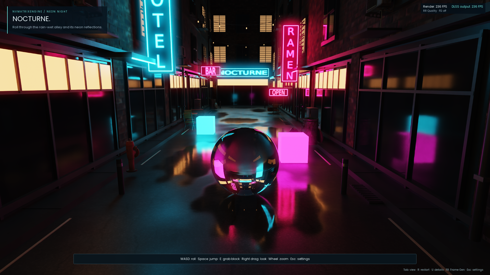

# NOCTURNE — Neon Night

A rain-wet nighttime alley with cyan and magenta neon, warm storefront windows, PBR brick/concrete/asphalt, and imported scanned street objects. The scene ships locally and runs offline.



Double-click [Play Neon Night.cmd](Play%20Neon%20Night.cmd) in the `engine` folder to find and launch an existing Neon Night build. The built runtime/release folder also includes its own **Play Neon Night.cmd**. Or run:

```powershell
.\NVMatrixFluidLab.exe --scene=neon-night
```

The first launch after a shader change can take around two minutes while the GPU driver compiles the ray-tracing pipeline. A [loading screen](../docs/screenshots/neon-night-loading.png) shows the current step, an animated activity bar and elapsed time. Lighting, model/texture loading and player collision setup run in background jobs while the window processes messages. Subsequent launches use the driver's cache. Esc or the close button cancels setup after the current job finishes; a driver compilation cannot be interrupted safely.

Neon Night uses the same glass-ball player, Bullet rolling/jumping controller, orbit camera, FPS display, and Esc settings UI as Water Lab.

- **WASD:** roll; **Space:** jump.
- **E:** grab/release a neon block; **left click / X:** throw it.
- **Right drag:** orbit/look; **wheel:** zoom; **Tab:** first-person/orbit view.
- **Esc:** pause and open settings; Esc or Resume returns to play.
- **R:** restart at the alley entrance; **U/H:** details and hints; **F8:** toggle frame generation.

The FPS panel shows measured render and presentation rates. The [settings menu](../docs/screenshots/neon-night-settings.png) controls DLSS quality, frame generation, lens/FOV, view mode, lighting, flashlight, audio, restart, and exit. The shared **Path tracing** section selects fast RIS or reference sampling and adjusts paths, lights, candidates, bounces and roulette. Fluid controls are hidden because this scene has no simulated water. The imported road, storefronts and street props provide triangle collisions for both the ball and camera.

Seven model sets and three architectural PBR texture sets come from [Poly Haven](https://polyhaven.com), under CC0. Models include weathered air conditioners, a hydrant, utility boxes, metal bins, café tables/chairs, bags, and wooden crates. [Credits and asset manifest](assets/neon-night/README.md) include the creators, original URLs and SHA-256 hashes. Assets are bundled at 1K for props and 2K for architectural textures (about 40 MB of original downloads).

The architecture, prop placement and sign designs are authored in `tools/build_neon_scene.py`. The result is an ordinary `assets/neon-night/neon-night.gltf` with external buffers/textures, loaded through the same importer as user models. Source models retain their PBR maps and transforms. A continuous authored wetness map varies pavement roughness across the alley on UV1, while the scanned asphalt color and normal maps tile on UV0. Signs use freshly rendered 4096×1024 or 1024×4096 lettering, with complete mip chains and texture filtering that accounts for the separate U/V dimensions of elongated signs.

Imported emissive triangles illuminate other surfaces through resampled direct lighting, visibility rays, and multiple importance sampling against the metallic/roughness GGX path tracer. Neon, shop windows and hanging bulbs provide the scene lighting. A quarter-resolution bright pass and separable Gaussian bloom add smooth optical halation before tone mapping. DLSS Ray Reconstruction filters one camera path per pixel, with two full light samples per bounce, four imported light candidates per reservoir and up to four surface bounces. Sign lights, blocks and the flashlight share the visibility-ray budget. Russian roulette terminates weak path tails and compensates surviving paths.

The pink and cyan neon blocks from Water Lab are physical objects: push, pick up, drop or throw them. Their lighting and reflections follow their motion. The imported environment and scanned props remain static. Wet patches use surface roughness; there is no falling rain or fluid simulation. Interiors use reflective window panels and lit shades. The existing engine's RTX/DXR/DLSS requirements still apply.

These are [engine-wide defaults and options](RENDER_SAMPLING.md), including fast resampled (RIS) lighting.

For measured frame times, the rendering bottleneck and reproducible profiling commands, see [RTXPT research and sampling improvements](RTXPT_COMPARISON.md) and the [earlier memory/traversal profile](NEON_PERFORMANCE.md). `profile-neon.ps1` records per-frame CPU/GPU timings, discards startup frames and exports median/p95 summaries with frame generation disabled. `-Sweep` compares reference and RIS with the same configured sample counts and roulette setting. `-Sampling ris` selects a single mode. `-Reference` restores the original sampler and fixed-depth loop; `-Paths 2 -LightSamples 4` selects the previous play budget. Lower budgets can increase reconstruction noise in motion.

For a reproducible capture:

```powershell
.\NVMatrixFluidLab.exe --scene=neon-night --frames=120 --capture --name=neon-night --width=1280 --height=720 --ser=off --atomics=fixed --frame-gen=off
```

Source assets are already present. To verify or restore them, run `python3 engine/tools/fetch_neon_assets.py` from the repository root. Rebuild the composition with `python3 engine/tools/build_neon_scene.py` (Python, ImageMagick, DejaVu Sans), then rebuild/copy assets to the runtime folder. No Python or ImageMagick is needed to run the packaged scene.

Initial scene/asset validation: [recorded GPU capture and checks](neon-night-validation.json). Current fast-sampling checks and timings: [engine-wide validation](sampling-validation.json). The 1080p image above is a direct engine capture with the playable ball and live HUD. All 243 Node checks, the portable importer suite, six transport variants, glTF/GLB/OBJ plus gameplay/ReSTIR GPU regressions, and the three native player/camera/watercraft tests passed. The 180-frame Neon controls test also passed, including DLSS resolution changes and pause/resume through the shared menu.

The native `lab_neon_player` CTest exercises movement, jumping, imported road/wall/prop collisions, camera sweeps, block pickup/throw, pause and restart. The GPU/UI check uses real window input and menu controls:

```powershell
.\NVMatrixFluidLab.exe --neon-controls-test --frames=180 --capture --name=neon-controls --frame-gen=off --ser=off --atomics=fixed
```

The native `lab_responsive_startup` test holds a worker busy beyond Windows' hung-window threshold while checking window messages and animation repainting. It also checks returned results, worker errors, and cancellation. The normal interactive CMD was tested with the default graphics settings, a resize during loading, and a separate close-during-loading run.
