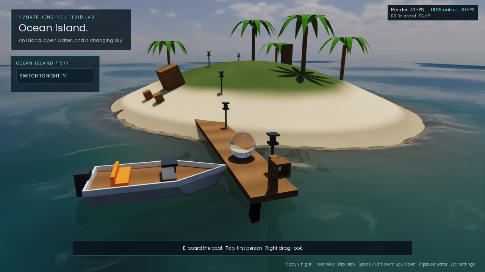
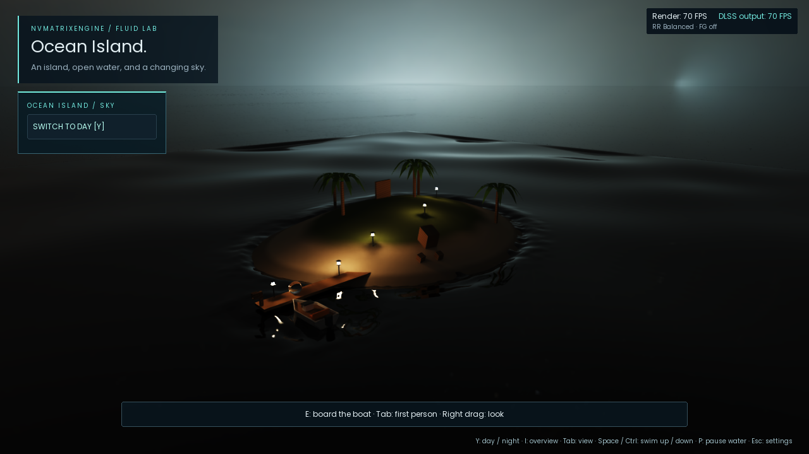
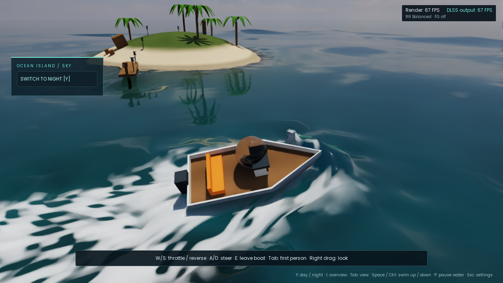

# Extra Large Water Lab: Ocean Island

Launch [Play Extra Large Water Lab.cmd](Play%20Extra%20Large%20Water%20Lab.cmd).
This opens a 256 × 256 metre interactive ocean area, with 6 m offshore depth,
a sloping beach island, palms, a pier, a boat, and day/night HDR environment lighting.
The interactive area is about 98 times the existing Large Water Lab's floor area.





```powershell
NVMatrixFluidLab.exe --water-lab=extra-large --normal-lens --quality=balanced
NVMatrixFluidLab.exe --water-lab=ocean --time-of-day=night --normal-lens --quality=balanced
```

Both preset names select the same scene. Hamiltonian water is the default;
`--water-path=baseline` remains an explicit full-3D comparison. The small and
large indoor labs retain their own scene, settings and solver defaults.

## Controls

- `Y` or the sky button switches day/night. The lighting button in Settings also works.
- Night is moonless; five warm lanterns light the pier and island path automatically.
  The flashlight in Settings helps with navigation away from the lamps.
- WASD moves; right-drag orbits; the wheel zooms; `Tab` changes first-person/orbit view.
- `I` switches to an island overview; mouse orbit still works there.
- Walk out on the pier and use `E` near the boat to board. W/S controls thrust and A/D steers.
  The 5.8 × 2.6 m motorboat has a tapered bow, flared hull, deck, seats and outboard.
- Hold Space underwater to propel upward, including in Sink mode; release it to
  resume natural buoyancy. Hold Ctrl to dive. Space still jumps on dry ground.
  Ocean starts with the lighter hollow ball; Settings can select solid glass.
- `P` pauses the water, `.` single-steps, `B` resets it. `T` operates the pier outlet.

## Rendering and physics

The visible terrain and Bullet collision mesh use the same sampled height
function. GPU fluid collision uses that function too. Terrain-derived coastal
activity promotes near-shore water to 3D simulation; submerged bodies and
resolved flow complexity retain the existing independent-region policy.

The larger wave grid is 128² (2 m spacing), with a 256² even-extension FFT and eight depth
velocity layers. A wind-weighted initial spectrum uses finite-depth dispersion;
the preset uses 11 m/s wind for its initial spectrum, HOS-2 with full nonlinear
coefficient, and a 0.8 m wave amplitude scale (approximately 1.6 m significant
wave height). Sixty-four irregular modes are normalized by spectral energy,
so adding wave components does not flatten the sea. It does not continually
inject wind energy. The parent simulation grid uses 1 m cells by default.
Cell size stays fixed around the boat, dock and other rigid bodies. Calm distant
water uses Hamiltonian waves; body interactions and excited flow use the existing
3D activity regions on that fixed grid. The experimental dynamic contact grid
has been removed from this release.

Water uses 9.81 m/s² gravity, 1,025 kg/m³ density, spectral absorption and Fresnel
reflection/refraction. The ocean adds an approximate 0.006 salinity correction
to the existing wavelength-dependent freshwater index. Buoyancy and boat load
continue to use displaced volume and actual body mass.

The boat's rendered hull, Bullet hull and imported fluid SDF share the same
vertices. Sixteen buoyancy probes integrate its tapered, flared cross-section;
550 kg dry mass, 6,000 N forward thrust and directional drag replace the small
twin-pontoon model. These are a gameplay motorboat model, not a calibrated vessel.
The initial wind spectrum follows the Phillips weighting described in
[Tessendorf's ocean notes](https://jtessen.people.clemson.edu/reports/papers_files/waterslides2001.pdf).

Submerged rigid bodies no longer carve a separate optical air shell. The
Hamiltonian reconstruction extends the wet field through solid boundaries below
the free surface; the actual rigid mesh handles its optical interface. Buoyancy queries use the existing outboard sampling distance of 2.5 simulation
cells to avoid the coarse hull boundary.


Hamiltonian rendering skips the unused particle covariance buffer and pass.
At the ocean's one-million-particle capacity this removes 48 MB (45.8 MiB) of
buffer storage without lowering surface resolution. The finer wave grid and
whitewater source index add about 29.6 MB back, for a net reduction of about
18.4 MB (17.5 MiB) in these GPU buffers versus the earlier ocean preset. This
does not yet make the distant MAC grids sparse; camera-distance water LOD is deferred.

The daytime and moonless-night HDRIs are linear Radiance RGBE assets from
[Poly Haven](assets/ocean/README.md). The same environment provides the visible
sky, dielectric reflections and importance-sampled diffuse illumination with
ray-traced visibility. Diffuse sky paths are counted once. The dominant daylight
source also launches refracted spectral photons for underwater caustics. Sand
uses diffuse dry/wet reflectance rather than the indoor polished tile material.
Illuminance/exposure normalization is documented with the assets; these are
reference lighting conditions, not an astronomical sun/time/location model.

Five warm lanterns illuminate the pier and island path at night. Each is a
12-lumen spherical emitter with a visible globe, solid post and shade. Their
area-light sampling gives distance falloff and soft ray-traced shadows; globes
also appear in dielectric reflections. They use the same photographic exposure
as the night HDRI and switch off in daylight. Lamp color is an RGB approximation;
refracted underwater lamp caustics are not included in the sunlight photon pass.

Environment sampling follows the solid-angle treatment described in
[PBRT's infinite-area-light chapter](https://www.pbr-book.org/4ed/Light_Sources/Infinite_Area_Lights).

## Wake and whitewater



Whitewater uses bounded GPU particles for foam, bubbles and spray, driven by
surface speed, deformation, curvature and velocity differences. A GPU compaction
pass selects live near-surface carriers, so emission no longer falls as the
Hamiltonian region leaves more unused IDs in the particle pool. Birth positions
project onto the actual reconstructed interface; secondary particles advect,
collide with the scene, change phase and expire. Foam accumulates in a persistent
advected coating with filtered subgrid rafts and grain. There is no boat-speed
switch or special nozzle emission rule. This remains a one-way secondary-phase
approximation, not a resolved air/water two-phase solver.

The ocean retains metre-scale 3D cells and a 2 m wave grid, so its wakes do not
resolve the fine spray and hull detail of the paper's boat examples. The paper
also uses Houdini whitewater and additional spectral render detail. This is an
engine integration of the hybrid method, not a reproduction of that full pipeline.

## Limits

This remains a bounded hybrid water experiment. The spectral solver assumes a
constant offshore depth; island collision and local 3D water do not turn it into
a complete variable-bathymetry surf/tide model. Small jets, hull contact and
shoreline breaking remain limited by the metre-scale 3D grid. Exact
island-displaced volume is not included in the rectangular wave-volume ledger.

The outer horizon is optical water geometry extending beyond the 256 m playable
simulation area. It is not additional interactive fluid. The simulation's outer
boundaries reflect waves; the last 4 m of rendered waves blend into the flat
outer optical surface. The optical seabed continues beyond the simulation; its
flat-water sunlight uses Snell refraction, Fresnel transmission and spectral
absorption analytically instead of a larger photon atlas. Vegetation is static
geometry, and wet-sand reflectance follows height near the
reference waterline rather than a sediment/moisture simulation.

## Validation

Run `engine/test-ocean.ps1` after building. The suite checks island/pier collision, camera
bounds, HDRI energy and sampling distributions, all three FFT grid sizes, a 600-frame
ocean run, day/night lantern state and outlet controls, night ReSTIR PT, and both indoor defaults.
The 600-frame `--ocean-swim-test` exercises seabed travel, underwater air-pocket
probes, held/released Space and a powered boat voyage with a capsize check.
It validates live ocean whitewater particles; a separate indoor inlet case checks
foam, bubbles and spray through real DXR entry/exit/IOR probes.
The generated `ocean-validation.json` records the rendered GPU results.
